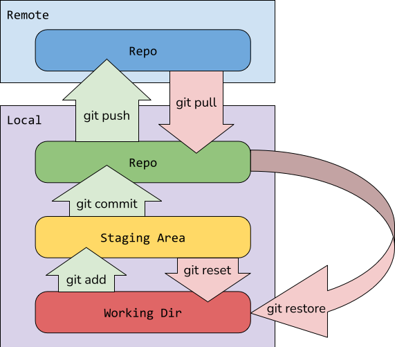

# Table of contents
1. [git install](#git-install)
2. [Setting up SSH for GitHub repository](#setting-up-ssh-for-github-repository)
3. [Basics](#basics)
	1. [Help](#help)
	2. [Repository](#repository)
	3. [Tracking](#tracking)
	4. [Staging](#staging)
	5. [Branch](#branch)
	6. [Merge](#merge)
	7. [Merge request/Pull request](#merge-request)
	8. [Undo](#undo)

# git install

**Installing git**
 1. Download installer: Go to [https://git-scm.com/downloads](https://git-scm.com/downloads), 
 2. download the latest version, then run the downloaded .exe file and install git.
 3. Open terminal, git bash or command prompt
 4. Check version: `git --version`
>This checks that you have indeed installed git, you can also run this command to check the version of your git.

**Updating git**
If you have git installed and wish to update to the latest version, run:

    git clone https://github.com/git/git

# Setting up SSH for GitHub repository

 1. Open terminal
 2. Generate SSH key: 
	 Paste the text below, replace your_email@example.com with the email thats linked to your github account:
 `ssh-keygen -t ed25519 -C "your_email@example.com"`

	you will be prompted to "Enter a file in which to save the key", you can press Enter to accept the default file location, then you will be prompted to enter a passphrase and comfirm the passphrase, you can press Enter skip this step.
	

 3. Copy your key:
	go to: `C:\Users\USER_NAME\.ssh`
and find the key that you just generated and **copy its contents not the file itself**

 4. Add your key to github:
	 1. go to github
	 2. sign in, if you have already signed in, you dont need to sign in again
	 3. click on your profile picture at the top right corner
	 4. go to settings
	 5. under access section on the left menu, select **"SSH and GPG key"**
	 6. click **"New SSH key"**
	 7. give the key a name, select "Authentication Key", then paste your key into the key section
	 8. click **"Add SSH key"**

# Basics

## Help

**Show an exhaustive list of git command and its descriptions:**

    git help
**Show the detail manu of a specific command**

	git help COMMAND

>replace COMMAND with a command name

## Repository

>Also known as **repo**

The location of the canonical/main version of your source code.

A repository can be local or remote:
 - A local repository is where you might store projects that you don’t need to share with anyone else
 - A remote repository is setup on a central server, where multiple users can access it. GitHub and GitLab are popular free hosting platforms for remote repositories.
   
  
**Creates a local Git repo in the current folder:**

    git init

**Copies a remote repo to local machine:**

	git clone URL
>**Remark:** If clone falued due to access right issues, consult **Setting up SSH for GitHub repository** section above

**Download files to local repo:**
	
	git pull

**Upload files to remote repo:**

	git push

## Tracking

Tracking refers to Git monitoring specific files.
there are 4 state of a file:

 - **Untracked:** Git is not monitoring this file
 - **Unmodified:** Git is monitoring the file, and there has been no change since last add or last commit
 - **Modified:** There has been a changes
 - **Staged:** Ready to be commited

**Check file status:**

	git status

**Track a new file:**

	git add FILE_NAME
>	**Remark:** git will track the file after git add forever until manually command git to stop tracked

**Track all files:**

	git add .

**Stop tracking:**

	git rm --cached FILE_NAME

## Staging

The staging area is like a prep zone where you review what changes should go into your next commit.
>**Remark:** even though tracking and staging shares the same command, they are diffrent concepts and have diffrent functions and behavior

**Add one file:**

	git add FILE_NAME
>This need to be ran every time you stage a file

**Add all file:**
	
	git add .

**Commit:**
>Submit files from staging area to local repo

	git commit

**Flags for commit:**

 - Stage and commit: -a
 - Commit with message: -m "message"
>**Remark:** -a only commit tracked files, both -a and -m can be used together, i.e:

    git commit -a -m "message"

## Branch

A branch is an independent line of development. It lets you work on a feature, fix, or experiment without affecting the main project.

**List branches and your current location:**

	git branch
**Create a branch:**

	git branch BRANCH_NAME
>**Remark:** can also be done in github website

**Delete a branch:**
	
	git branch -d BRANCH_NAME

**Swich to a branch:**

	git checkout DESTINATION

>**Remark:** If a new branch is created after your latest git pull, then you need to run git pull then you will be able to go the branch

**Create and swich at the same time:**

	git checkout -b BRANCH_NAME

**Merge branch:** 
>This merges the BRANCH_NAME  to the current branch that you are at

	git merge BRANCH_NAME

## Merge

Merge combines changes from one branch into another, there are four types of merge, see details below.

**Fast-Forward Merge:**
If destination branch hasn’t moved forward since the other branch started, then git will simply combine commits:

    main:    A---B
	              \
	feature:        C---D

	After merge:
	main:    A---B---C---D

Procedure: 

	git checkout DESTINATION_BRANCH
	git merge BRANCH_A

>**Remark**: This merges BRANCH_A to DESTINATION_BRANCH. When you enter merge, your IDE might prompt you enter message in a file. After you have entered a message, close the window to proceed.

**No-Fast-Forward Merge:**
If both branch has commits, then git will create a new commit that combines both histories:
	
	main:    A---B---C
	                  \
	feature:           D---E

	After merge:
	main:    A---B---C--------F
	                  \      /
	                   D----E

Procedure: 
	
	git checkout DESTINATION_BRANCH
	git merge --no-ff BRANCH_A

**Squash Merge:**
Combines all the feature branch’s commits into one, this helps to keep the destination branch clean.

    main:    A---B
	               \
	feature:         C---D---E

	After squash merge:
	main:    A---B---F ,where F = C, D, E

Procedure:

    git checkout DESTINATION_BRANCH
	git merge --squash BRANCH_A
	git commit -m "message"

**Rebase Merge:**
Instead of creating a merge commit, rebase rewrites commit history to make it linear

	main:    A---B---C
			      \
	feature:        D---E

	After rebase:
	main:    A---B---C---D'---E'
Procedure:

	git checkout BRANCH_A
	git rebase DESTINATION_BRANCH
	git checkout DESTINATION_BRANCH
	git merge BRANCH_A 

**Merge conflicts**
A merge conflict happens when Git tries to merge two branches, but can’t automatically decide which changes to keep, usually because the same lines of code were modified in both branches.

When this happens, git will mark your file like this:

    <<<<<<< HEAD
	<h1>Welcome to the Home Page</h1>
	=======
	<h1>Welcome to the NEW Home Page</h1>
	>>>>>>> feature

Solution:

    manually resolve each conflict

**Example of merging**

    git checkout BRANCH_A           # Step 1: Go to the target branch
	git pull origin BRANCH_A        # Step 2: Make sure it’s up to date
	git merge BRANCH_B              # Step 3: Merge the feature branch
	git push origin BRANCH_A        # Step 4: Push the result to GitHub

## Merge request
>**Remark: merge request is also called pull request, they are the same.**

Merge request allows someone to review your content before merging.

Procedure: 

Commit your changes with `git push origin BRANCH_NAME`

 1. Go to your GitHub repo
 2. If you have pushed your commit recently, there should be a prompt showing up in a yellow bar, click on **Compare & pull request** and **skip to step 8**
 3. If the bar didn't show up, go to **Pull request** tab
 4. Click **New pull request**
 5. For **Base** branch, choose the branch that you are merging into
 6. For **Compare** branch, choose the branch that you are merging from
 7. Click **Create pull request** 
 8. Fill in details
 9. Click **Create pull request** to submit the request
---**Other related commands**
 9. Uploads your local commits on the specified BRANCH to the remote: 	`git push origin BRANCH_NAME`
 10. Downloads the latest changes from the specified branch on GitHub into your local repo, and merges them: `git pull origin BRANCH_NAME`

## Undo
**Discard unstaged changes:**

	git restore FILE_NAME
**Unstage a file:**

	git reset FILE_NAME
 **Undo all changes, revert all file to last commit:**
 
	 git reset --hard
**Undo all changes, revert all file to last state of the remote:**
 
	 git reset --hard origin/BRANCH_NAME
**Undo last commit (pre-push):**

	git reset --soft HEAD~1
**Amend last commit (pre-push):**

	 git commit --amend`
**Revert a pushed commit (post-push):**

	git revert COMMIT_HASH
**Force undo to old commit (post-push):**

	git reset --hard COMMIT_HASH
	git push --force
**Save work temporarily:** 
 
	 git stash

# to be added: useful procedures
